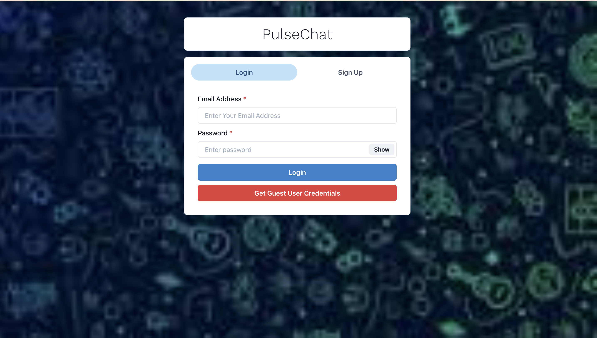
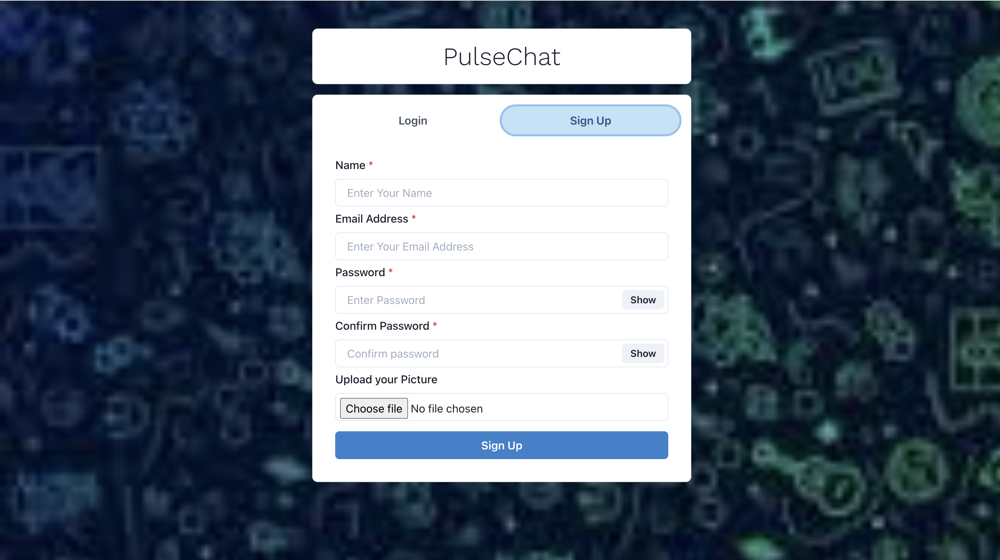
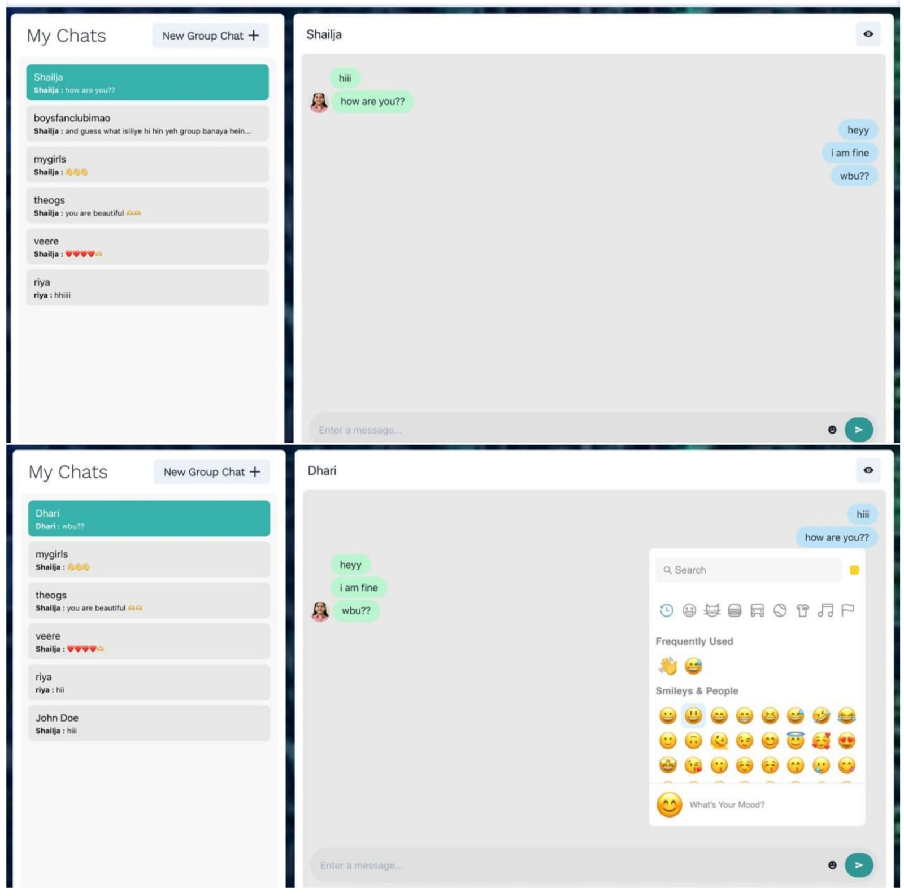
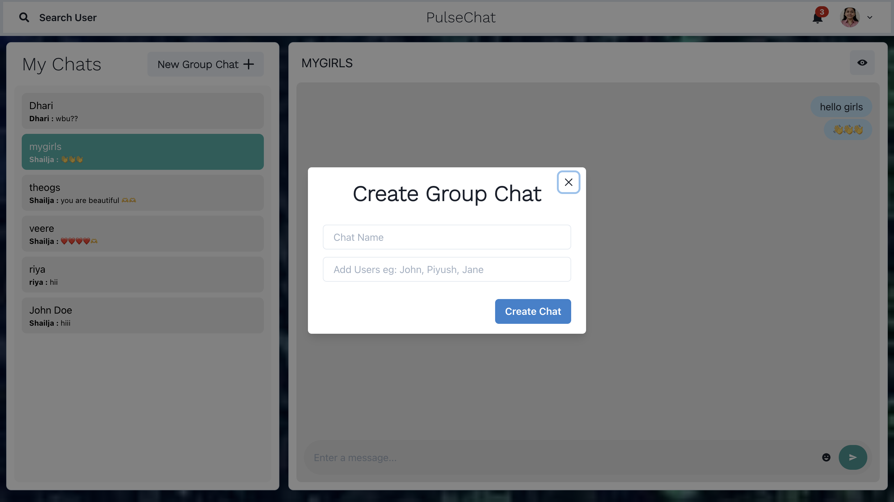
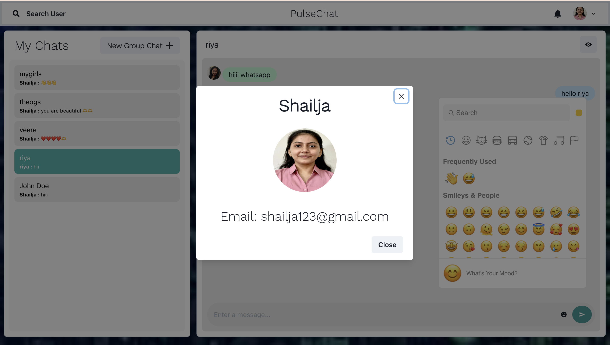
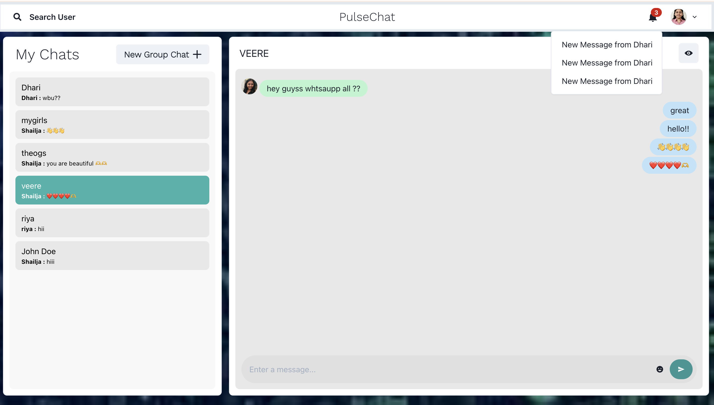
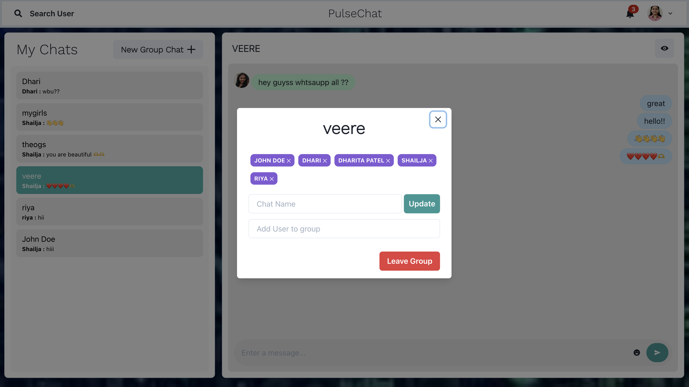

PULSECHAT
# PulseChat – Real-Time Chat Application

PulseChat is a modern, real-time chat application designed to provide seamless one-to-one and group communication with a clean, intuitive user experience. The platform focuses on instant messaging, live updates, and smooth interaction using real-time socket communication.

Built with scalability and usability in mind, PulseChat supports private chats, group conversations, user profiles, typing indicators, and instant message delivery — making it suitable for personal, academic, or collaborative use.

## Live Demo

🔗 *https://pulsechat-xalu.onrender.com*

## Table of Contents

* Overview
* Key Features
* Application Pages & Flow
* Core Functionalities
* Real-Time Communication
* User Experience Highlights
* Security & Access Control
* Future Enhancements
* Screenshots

## Overview

PulseChat enables users to communicate instantly through a responsive web interface. The application focuses on real-time interaction, minimal latency, and smooth UI transitions. Users can create accounts, search for other users, initiate chats, create group conversations, and exchange messages in real time.

The application ensures that conversations remain synchronized across users while providing visual feedback such as typing indicators and live message updates.

## Key Features

###  User Authentication

* Secure user sign-up and login system
* Token-based session handling
* Persistent login using browser storage

###  One-to-One Chat

* Start private conversations with any registered user
* Messages appear instantly without page refresh
* Real-time updates ensure both users stay in sync

###  Group Chat

* Create group chats with multiple users
* Add or remove members dynamically
* Rename group chats at any time
* Group admin controls for managing participants

###  Real-Time Messaging

* Instant message delivery using WebSockets
* Typing indicators to show active users
* Automatic message updates without manual refresh

###  Notifications

* Unread message notifications for inactive chats
* Notification count updates dynamically
* Seamless transition to active chats on click

###  Emoji Support

* Built-in emoji picker for expressive conversations
* Emojis seamlessly integrated into messages

###  Profile Management

* User profile view with avatar support
* Profile modal displaying user details
* Visual identity maintained across chats

---

## Application Pages & Flow

### Authentication Pages

* **Login Page**
  Allows existing users to securely log into the application.

* **Sign-Up Page**
  Enables new users to create an account and access chat features.

---

### Chat Dashboard

* Displays all active chats (private and group)
* Shows latest message preview for each chat
* Highlights selected chat for clarity
* Provides access to group creation

---

### Single Chat Page

* Real-time conversation window
* Scrollable message history
* Typing indicator animations
* Emoji support
* Instant message sending and receiving

---

### Group Chat Modal

* Create new group chats
* Search and add users
* Remove participants
* Rename group chat
* Admin-only controls

---

### Profile Modal

* Displays user avatar
* Shows user name and email
* Accessible directly from chat header

---

## Core Functionalities

* **Live Message Sync** – Messages are instantly synchronized across all connected users
* **Socket-Based Communication** – Ensures low latency and real-time updates
* **State Management** – Maintains chat state, selected chat, and notifications
* **Responsive UI** – Works smoothly across different screen sizes

---

## Real-Time Communication

PulseChat leverages real-time socket connections to:

* Deliver messages instantly
* Broadcast typing indicators
* Handle user join/leave events
* Automatically reconnect on temporary disconnections

This ensures uninterrupted communication even during network fluctuations.

## User Experience Highlights

* Clean and minimal interface
* Smooth chat transitions
* Visual feedback for typing and message delivery
* Optimized for readability and ease of use
* Intuitive navigation between chats

## Security & Access Control

* Only authenticated users can access chat features
* Token-based authentication for secure requests
* Private chats remain accessible only to intended participants
* Group chat actions restricted to authorized users

## Future Enhancements

* Message read receipts
* Media and file sharing
* Voice and video calling
* Message search functionality
* Message reactions
* Online/offline user status indicators

## Screenshots

## Screenshots

### Chat Dashboard 

### Login Page 

### Sign-Up Page 

### One-to-One Chat Page 

### Group Chat Creation 

### Profile Modal 

### Notifications Panel 

### Search Users 

### Add / Remove Group Members 

**PulseChat** is designed to be fast, intuitive, and scalable — delivering a smooth real-time communication experience with modern UI principles and robust interaction handling.

  
